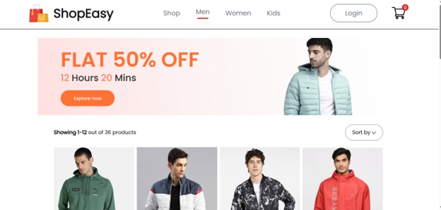
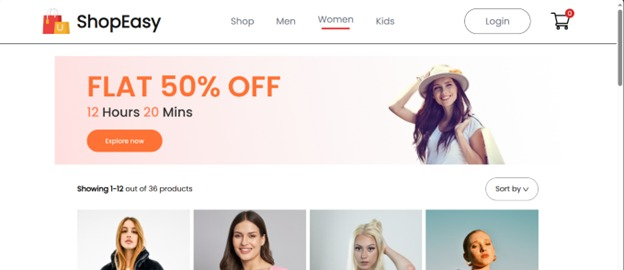
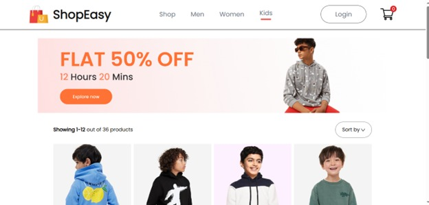
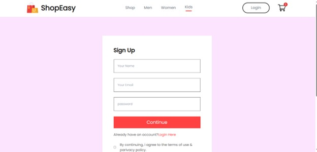
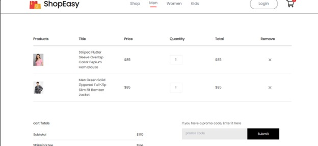

#Description
EasyShop Website is a responsive and user-friendly e-commerce platform designed to provide a seamless shopping experience. Developed using React.js and styled with Tailwind CSS, the website offers a modern and visually appealing interface. Effortless browsing, convenient product filtering options, and detailed product information empower users to make informed purchase decisions. The optimized responsive design ensures that the website looks and functions flawlessly across various devices, including desktops, tablets, and mobile phones.

##Output_Screenshots

